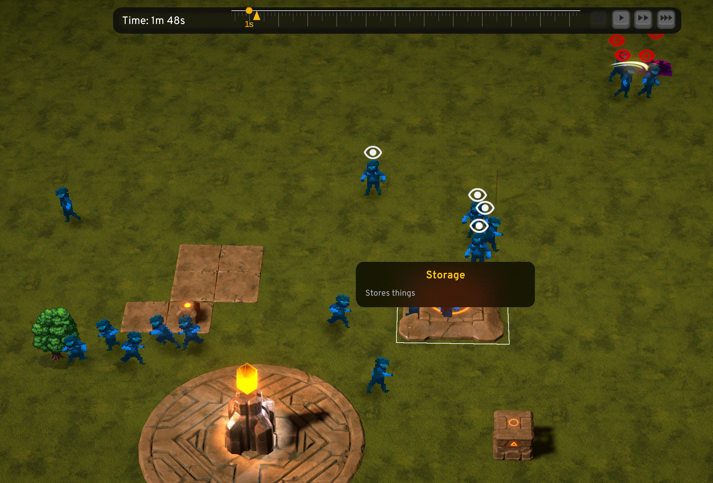
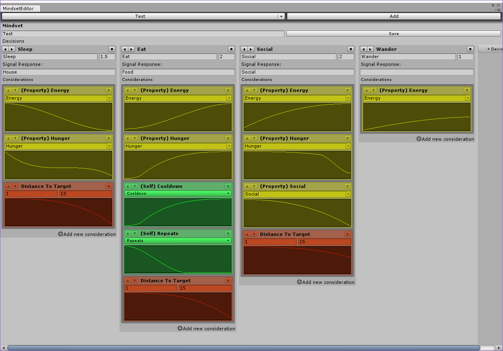

# ECS-AI



Some old code from 2018 using Unity DOTS ( 2019.2 ), with flexible and composable Utility AI (with editor) heavily inspired by Dave Mark's work and Sims AI. I am no longer working with Unity these days, so releasing this code is the least I can do to contribute back to the open source community.

> ⚠ BEWARE: This project is in an unfinished state, however back then it was running fine without warnings or bugs. You will see a lot of code commented out that I was planning to eventually convert to ECS. I'm only sharing this 3 years after I stopped working on it. It contains a lot of complex systems and lacks proper documentation, so I tried to write as much as possible to give at least some idea of what's what.

Most of the work in this project was used for this abandoned project. 
You can still find videos and images here: https://twitter.com/OutstandingXp

## Features 
- Extensible & composable **Utility AI system** (burst optimized)
  - Mindset represents a group of Decisions. You can stack multiple mindsets on an agent (e.g. default behavior + hunter + gatherer)
  - Decisions have all the UtilityAI basics, such as considerations, action to perform, weight and preference (bonus weight)
  - Decisions are only chosen when the agent is able to perform the action (or if the target/signal has an action that it can use)
  - Decisions can be either global or per target/signal (e.g. choosing the most dangerous enemy to attack or avoid)
  - Decisions can be overridden or nullified
  - All decisions are recorded in agents' short-term memory, when a decision fails (e.g. action aborted) we can add timeout before such decision is considered once again.
  - Debug tool (MindInspector) that shows the state of mind, with all the signals considered, decisions, historical timeline graph for easier debugging of aborted actions/decision changes/and so much more.
  - Designed to work with external data for easy modding
  - **Utility AI Mindset Editor** - mindsets are group of possible decisions an agent can take.
    - Includes various helpful editor components like `Range,Value,Property,Boolean,Ability` (can also be combined)
  - Considerations: Affects the score of the decision. Basic consideration types are included, but there's also a codegen tool (ConsiderationMapGenerator) if you want to add new kind of considerations. Basic types include:
    - `Cooldown` - can be used to prevent an action from being performed again
    - `Repeats` - can be used to introduce/reduce boredom, e.g. make agent avoid eating food after eating few times, or make them more likely to eat more for a predefined duration
    - `Target_Distance` - distance to target/entity/signal
    - `Target_Health` - percent of health, can be used to make AI target low-health entities
    - `Target_Needs` - what kind of needs does the target satisfy (e.g. villagers are food to enemy, apples satisfy thirst and food for villagers )
    - `Target_AccessTag_All` - affects score depending if all tag (bitflags) match with the target. You could also make one for any flags by copying this consideration type and its system.
    - `Stamina` - each agent has stamina which gets reduced (attacking) and replenished based on actions (sleeping)
    - `HasAssignment` - defines if the player has explicitly asked the agent to perform something (e.g. cut down trees)
    - `IsEngaged` - uses detection system to make sure we've seen our target/signal clearly. e.g. AI engaged in combat pursues enemy even after enemy disappears behind fog of war. 
    - `Boolean` - uses agent blackboard value (not yet ported to ECS)
    - `Property` - uses agent blackboard value (not yet ported to ECS)
- **Spatial Awareness** (burst optimized) - keeps track of all entities that can receive a signal, in a grid partitioned hashmap.
- **Signaling system** (burst optimized) - works in tandem with utility AI to perform considerations, this is also what allows agents to see the world around them. Signals can be broadcasted to all listening entities around them, or can be targeted to specific entity. All objects and agents have a signal associated with them, with radius, faction and other details can be added as components like needs (food/water), tags, etc.. since signals are also entities
- **Detection system** (burst optimized) - brings short-term memory to spatial awareness, in order to avoid agents from noticing a signal straight away and to remember even if the signal is out of range
- **Local & Global Influence Map system** (burst optimized) with debug previews
  - Global influence map also used for **Fog of war** system (burst optimized)
  - Used to avoid/go towards danger
  - Used to avoid agents from wandering too close to obstacles and buildings
  - Has debug visualizations
  - Has a very nice syntax
```cs
agent.localGrid.Start(agent.GetPosition(), context.GetStateTrackHash())
    .AddFalloff(randomDestination, 10f, 1f)
    .AddMultipliedMap(WORLD_OBSTACLES, -100f)
    .AddReversedMultipliedMap(BUILD_SPACE, -20f)
    .AddPositiveClampedMap(agent.Faction, -1f)
    .AddPositiveFalloff(Vector3.zero, 100f, 0.5f)
    .ReduceValuesAroundSelf(25f)
.End();
```
- **Smart Objects** (SO) - world objects that agents can interact with. They advertise a signal for agents to consider, and through use of StateScript which injects actions to perform for agents, can allow more complex behavior like for instance queuing up in front an occupied toilet or sitting around a bonfire if there's any space.
- **StateScript** (shared/local sequential actions that can be aborted and dynamically injected to other agents with optional synchronization) inspired by Sims. Used for :
  - Used for all agent behaviors - walking, sleeping, attacking
  - It's a list of StateDefinitions which act like a track of actions to play. Think of it like short video clips.
  - Multiple StateDefinitions can be used for graceful interruption
  - Can be used to force scripted scenarios, or force player actions like moving agent to a location
  - Can be used to inject behaviors to other agents e.g. cop agent arresting a thief
  - Allows Smart Objects to dictate how they can be used. e.g. table dictates on which chair to sit and which animations to play 
  - Synchronize two agents to perform high-five to each other.
  - Has a nice debug tool (MindInspector) showing which actions were completed, playing, queued or aborted.
```cs
new StateScript("Wander",
  new StateDefinition("move"){
      {
          ____BEGIN____,
          (context) => {
              // influence map generated inside to avoid buildings and going near the fog of war
              PickAndSetRandomDestination(context); 
              context.Wait();
          },
          (context) => {
              var agent = context.data.Get<Agent>("self_agent");
              if (!agent.localGrid.IsGenerated) {
                  context.Suspend(); // suspend this action until influence grid is ready
                  return;
              }
              context.data.SetVec("destination", agent.localGrid.highestPosition);
          },
          Actions.MoveToDestination,
          (context) => {
              var agent = context.data.Get<Agent>("self_agent");
              agent.NavMeshAgent.speed = 5;
          },
          Actions.HasArrivedToDestination,
          Actions.Wait,
          Actions.Repeat
          (context) => Debug.Log("State definition is just bunch of sequential functions!")
      },
      { ____UPDATE____, (context) => Debug.Log("Called on each tick") },
      { ____END____, (context) => Debug.Log("Ended or interrupted normally") },
      { ____EXIT____, (context) => Debug.Log("Interrupted (new decision, scripted action, agent died)") }
  },
  new StateDefinition("dance?"){ }
);
```
- A lot of these things were built with "factions" in mind, in order to distinguish friendly/enemies/neutral/other
- Many **visual debugging gizmo tools** (e.g. influence map, as seen on the twitter videos)
- **Object Raycast** - Agent selection done the right way. e.g. clicking nearby an agent will attempt to select the closest agent, or closest to camera
- Supreme-Commander-inspired RTS camera controls


## Bit more about the AI and the pseudo-game

A simple god game where autonomous villagers perform actions (e.g. collect resources and bring them to a stash, pray) based on their needs. They walk around without expanding the fog of war. You can request them to build houses or ask a villager to move to a certain spot, they go to sleep at night and procreate to create more villagers. Enemy AI is also there where Slimes spawn in order to attack the villagers, they will also try to drag the corpse away from danger in order to consume them. Villagers will avoid danger and dangerous zones if they can't defend themselves. Weapons can be picked up by villagers (using signals), once picked up it introduces a new mindset (group of new possible decisions and actions) on top of their existing mindset, which allows aggressive/attack behavior and prevents fleeing from enemies.
Smart objects are designed with slots (think of Sims), a table where only X villagers can sit at. Toilet where villagers can queue in front. Villages also have an eye indicator, showing if their aggression state

## An outdated screenshot of the editor
#### See my note below to why I couldn't grab new screenshots.


## How to run/compile this?
Unfortunately Unity has decided to delete some of the old packages this project was depending on (seriously what's the point of having packages with versions if you're gonna delete them in the future). So in order to run this project you will need to update and fix the errors. 

If you're brave enough to fix the errors, I would really appreciate if you could contribute your changes back with a pull request.


## Note about models and sprites
Most of them are just placeholders, so please avoid using them as they are not covered by this project's license.